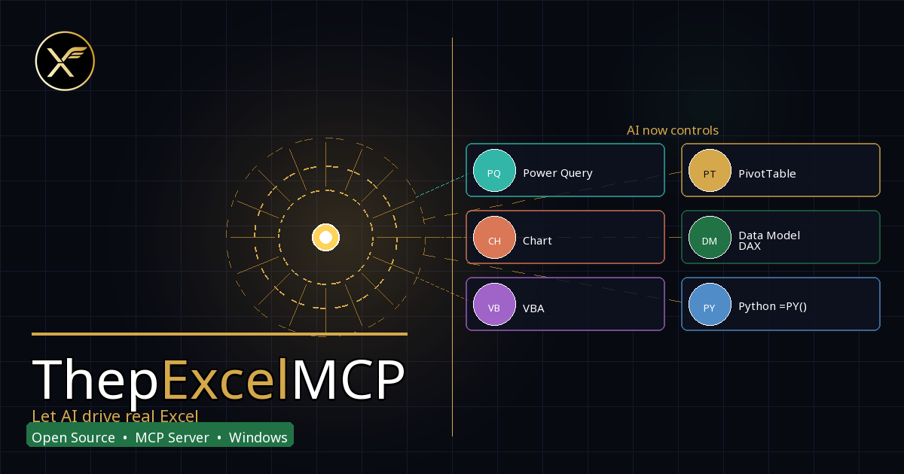

<div align="center">



# ThepExcelMCP

**Give your AI agent hands on the real Excel — not just the file.**

A Windows MCP server that drives a **live, running Excel Desktop** through COM automation.
Power Query that actually refreshes, PivotTables that actually pivot, DAX that actually calculates,
and screenshots so the AI can *see* what it built.

[](https://github.com/ThepExcel/ThepExcelMCP/actions/workflows/ci.yml)
[](pyproject.toml)
[](#platform-support)
[](LICENSE)
[](tests/)
[](https://modelcontextprotocol.io)

[Quick start](#quick-start--hand-it-to-your-ai-agent) ·
[Why live COM?](#why-a-live-excel-not-a-file-library) ·
[Tools](#the-26-tools) ·
[Install](#install) ·
[Safety](#safety-model) ·
[Troubleshooting](#troubleshooting)

</div>

---

## What is this?

ThepExcelMCP is a [Model Context Protocol](https://modelcontextprotocol.io) server that exposes
**26 tools** covering nearly everything a power user can do in Excel — workbooks, ranges, Tables,
Power Query (full M-code CRUD), PivotTables, the Data Model with DAX measures, charts, formatting,
conditional formats, validation, slicers, page setup / PDF export, protection, VBA (opt-in), and a
safety layer with non-destructive snapshots and range/sheet diffing.

It is for anyone who works in **Excel on Windows** and wants an AI agent
(Claude Code, Claude Desktop, Codex CLI, or any MCP client) to do real spreadsheet work:
analysts automating monthly reporting, Excel pros building Power Query pipelines by prompt,
and developers who need an agent to build *and verify* real workbooks.

When an agent calls a tool here, it is talking to the actual Excel process — **including the
workbook you already have open**. This is the difference between editing an XML zip file and
actually using Excel.

## Quick start — hand it to your AI agent

Send this GitHub link to your AI coding agent (Claude Code, Codex CLI, …) and tell it to take
over — it will read this README and set the MCP server up for you, as either **user scope**
(every project) or **project scope** (one project only). ❤️

> 🇹🇭 แค่ส่งลิงก์ GitHub นี้ให้ AI Agent ของคุณ แล้วบอกให้ AI จัดการต่อได้เลย จะลง MCP เป็น User Scope หรือ Project Scope ก็ได้ ❤️

```
https://github.com/ThepExcel/ThepExcelMCP
```

Once registered, just talk to your agent. Things you can say:

- *"Read the table on Sheet1 of Book1 and build a PivotTable of sales by Region, with a chart."*
- *"Write a Power Query that loads `products.csv` and `orders.xlsx`, merges them on ProductID, and loads the result into a Table."*
- *"Add a DAX measure `Total Revenue = SUM(Orders[Amount])` to the Data Model and format it as currency."*
- *"Format the report header on the Summary sheet — bold, fill `#4472C4`, white text, freeze the top row — then screenshot it so you can check it looks right."*
- *"Take a snapshot of this workbook first, then replace every occurrence of 'Widget' with 'Gadget' across the whole workbook and show me a diff."*

## Why a live Excel, not a file library?

File-based libraries (`openpyxl`, xlsx skills, raw XML editing) read and write the `.xlsx` on
disk — but they cannot *operate Excel*. Driving the real application means the agent can author
a complete solution from a blank workbook, on live data, with Excel doing the computing:

| Capability | File libraries (openpyxl etc.) | ThepExcelMCP (live COM) |
|---|---|---|
| Read/write cells & formulas | ✅ | ✅ |
| **Evaluate formulas / dynamic arrays** (`XLOOKUP`, `FILTER`, spill) | ❌ stale cached values | ✅ live calc engine, spill read-back |
| **Power Query** — create/edit M code, refresh against sources | ❌ | ✅ full CRUD + refresh + parameters |
| **PivotTables** with real aggregation | ❌ (often destroyed on save) | ✅ create, field ops, layout, read |
| **Data Model / Power Pivot** — relationships, DAX measures | ❌ | ✅ + CUBEVALUE/CUBEMEMBER helpers |
| **Charts** incl. true PivotCharts | ⚠️ limited, fragile | ✅ create/configure + PNG export |
| **Visual verification** — screenshot what was built | ❌ | ✅ range / sheet / chart → PNG |
| Work on the **workbook you already have open** | ❌ file must be closed | ✅ attaches to the running instance |
| VBA macros, PDF export, slicers, threaded comments | ❌ | ✅ |

Every call runs through a single STA COM worker thread, so Excel's own rules for calculation,
formatting, and events apply exactly as they would for a human at the keyboard. And because the
agent can **screenshot** any range, sheet, or chart, it can close the loop: build → look → fix.

## How it runs — local, not a hosted service

ThepExcelMCP is a **stdio MCP server that runs as a process on your own Windows machine** and
controls the Excel running there. Nothing to sign up for, no account, and no spreadsheet data
leaves your computer.

- ✅ **Claude Code**, **Claude Desktop**, and **Codex CLI** run locally and can launch it.
- ❌ Cloud-only agent surfaces that can't run a local process on your machine can't reach your
  local Excel, so they can't use it.

## The 26 tools

Grouped by capability — every tool is action-dispatched (`action="..."`), with precise,
example-rich docstrings that serve as the LLM-facing API.

| Area | Tools | What the agent can do |
|---|---|---|
| **Workbooks, sheets & data I/O** | `excel_workbook` · `excel_sheet` · `excel_range` · `excel_table` | Open/create/save workbooks, manage sheets, read/write ranges (paginated, spill-aware, `Formula2` dynamic arrays, experimental `=PY()`), full Excel Table (ListObject) lifecycle: sort, filter, styles, totals, structured references |
| **Power Query & Data Model** | `excel_powerquery` · `excel_datamodel` · `excel_name` | Create/edit/refresh M queries with a built-in M static analyzer, query parameters, load to Table or Data Model; model tables, relationships, DAX measures; CUBE formula helpers; named ranges & LAMBDA functions |
| **PivotTables** | `excel_pivot` · `excel_slicer` | Create pivots from a range, Table, or the Data Model; add/move/remove fields with real aggregations; layouts & subtotals; slicers and date timelines |
| **Charts & visual verification** | `excel_chart` · `excel_screenshot` · `excel_shape` · `excel_sparkline` | Create/configure charts (incl. true PivotCharts), export chart PNGs; capture any range/sheet/chart as PNG so the agent can *see* its work; images, text boxes, AutoShapes; in-cell sparklines |
| **Formatting, layout & print** | `excel_format` · `excel_conditional_format` · `excel_validation` · `excel_view` · `excel_outline` · `excel_page_setup` · `excel_comment` · `excel_hyperlink` | Fonts/fills/borders/number formats/alignment, data bars & color scales & icon sets, dropdown validation, freeze panes/zoom/gridlines, row-column grouping, print setup + **PDF export**, notes & threaded comments, hyperlinks |
| **Safety, audit & power tools** | `excel_snapshot` · `excel_diff` · `excel_find_replace` · `excel_protection` · `excel_vba` | Non-destructive snapshots (SaveCopyAs) with safe restore, cell-by-cell diff of ranges or whole sheets, find/count/replace at range/sheet/workbook scope, sheet & workbook protection, VBA module CRUD + macro run (double opt-in) |

<details>
<summary><strong>Full action list per tool (click to expand)</strong></summary>

| Tool | Actions |
|---|---|
| `excel_workbook` | `list`, `info`, `open`, `save`, `close`, `create`, `save_as` |
| `excel_sheet` | `list`, `add`, `rename`, `delete` |
| `excel_range` | `read` (paginated, spill metadata), `read_spill`, `write`, `write_formula` (Formula2 / dynamic arrays), `write_py` (`=PY()`, experimental), `clear` |
| `excel_table` | `list`, `create`, `read` (paginated), `append_rows`, `add_column` (with formula), `sort`, `filter`, `set_style`, `toggle_totals`, `rename`, `delete` |
| `excel_powerquery` | `list`, `get`, `create`, `update`, `delete`, `refresh`, `refresh_all`, `load_to_table`, `load_to_datamodel`, `analyze`, `analyze_raw`, `create_parameter`, `get_parameter`, `set_parameter`, `list_parameters` |
| `excel_pivot` | `list`, `create` (range/table/datamodel source), `add_field` (aggregation + number format), `remove_field`, `move_field`, `set_layout`, `refresh`, `delete`, `read` (paginated) |
| `excel_datamodel` | `info`, `list_tables`, `add_table`, `list_relationships`, `add_relationship`, `delete_relationship`, `list_measures`, `add_measure` (DAX), `update_measure`, `delete_measure`, `refresh`, `cube_value`, `cube_member`, `cube_formula` |
| `excel_name` | `list`, `get`, `set`, `delete` (named ranges, constants, LAMBDA — with `is_lambda` flag) |
| `excel_chart` | `list`, `create`, `configure`, `set_source`, `export_image` (PNG), `delete` |
| `excel_screenshot` | `range`, `sheet`, `chart` |
| `excel_shape` | `add_image`, `add_textbox`, `add_shape`, `list`, `move`, `delete` |
| `excel_slicer` | `add`, `add_timeline`, `list`, `delete`, `connect` |
| `excel_sparkline` | `add` (line/column/win-loss), `clear`, `list` |
| `excel_format` | `font`, `fill`, `border`, `number_format`, `alignment` (incl. merge), `column_width`, `row_height`, `autofit` |
| `excel_conditional_format` | `data_bar`, `color_scale`, `icon_set`, `cell_rule`, `top_bottom`, `clear` |
| `excel_validation` | `list` (dropdown), `whole_number`, `decimal`, `date`, `text_length`, `custom`, `clear` |
| `excel_view` | `freeze_panes`, `unfreeze_panes`, `gridlines`, `zoom`, `headings` |
| `excel_outline` | `group_rows`, `group_columns`, `ungroup_rows`, `ungroup_columns`, `show_levels`, `clear` |
| `excel_page_setup` | `set` (orientation/paper/margins/fit-to-page), `print_area`, `print_titles`, `header_footer`, `export_pdf` (sheet or workbook), `get` |
| `excel_comment` | `add`, `edit`, `reply`, `delete`, `list`, `get` (legacy notes + threaded comments) |
| `excel_hyperlink` | `add` (url/internal/email/file), `list`, `delete` |
| `excel_protection` | `protect_sheet`, `unprotect_sheet`, `protect_workbook`, `unprotect_workbook`, `set_locked`, `status` |
| `excel_find_replace` | `find`, `count`, `replace` (range/sheet/workbook scope; match-case, whole-cell) |
| `excel_diff` | `ranges`, `sheets` (values, formulas, or both — pure read) |
| `excel_snapshot` | `snapshot` (SaveCopyAs), `list`, `restore` (opens copy as a NEW workbook), `delete` |
| `excel_vba` | `list_modules`, `get_module`, `write_module`, `delete_module`, `run` (opt-in, see [Safety](#safety-model)) |

Structured references work naturally: `excel_range(action="read", range="Orders[Amount]")`.

</details>

## Requirements

- **Windows 10 / 11**
- **Microsoft 365 Excel Desktop** — auto-launched with a blank workbook if not already running
  (opt out with `THEPEXCEL_MCP_AUTOLAUNCH=0`)
- **[uv](https://docs.astral.sh/uv/)** — installs and manages the right Python for you, so you do
  **not** need to install Python separately:

  ```powershell
  powershell -ExecutionPolicy ByPass -c "irm https://astral.sh/uv/install.ps1 | iex"
  ```

  Or via winget: `winget install --id=astral-sh.uv -e`. Close and reopen your terminal afterward.

## Install

```powershell
git clone https://github.com/ThepExcel/ThepExcelMCP.git
cd ThepExcelMCP
uv sync
```

`uv sync` installs `fastmcp`, `pywin32`, and `pillow` into an isolated virtual environment.
No pip or manual virtualenv setup required.

### Register with Claude Code (CLI)

```powershell
claude mcp add thepexcel-excel --scope user -- uv run --directory C:\path\to\ThepExcelMCP thepexcel-mcp
```

Substitute `C:\path\to\ThepExcelMCP` with your own clone path. Verify with `claude mcp list`.

To enable VBA as well:

```powershell
claude mcp add thepexcel-excel --scope user `
  -e THEPEXCEL_MCP_ENABLE_VBA=1 `
  -- uv run --directory C:\path\to\ThepExcelMCP thepexcel-mcp
```

### Register with Claude Desktop

**Option A — MCPB bundle (one file, drag-and-drop):**

```powershell
uv run python scripts/build_mcpb.py
```

This produces `dist/thepexcel-mcp.mcpb` — open it with Claude Desktop (Settings → Extensions) to
install the server as a desktop extension.

**Option B — manual config.** Edit `%APPDATA%\Claude\claude_desktop_config.json`:

```json
{
  "mcpServers": {
    "thepexcel-excel": {
      "command": "uv",
      "args": ["run", "--directory", "C:\\path\\to\\ThepExcelMCP", "thepexcel-mcp"]
    }
  }
}
```

Restart Claude Desktop after saving.

<details>
<summary><strong>Register with Codex CLI</strong></summary>

Codex talks MCP over the same stdio transport. `codex mcp add` writes to your **user-scoped**
config (`~/.codex/config.toml`):

```powershell
codex mcp add thepexcel-excel -- uv run --directory C:\path\to\ThepExcelMCP thepexcel-mcp
```

Verify: `codex mcp list` / `codex mcp get thepexcel-excel`. Equivalent manual edit:

```toml
[mcp_servers.thepexcel-excel]
command = "uv"
args = ["run", "--directory", "C:\\path\\to\\ThepExcelMCP", "thepexcel-mcp"]
```

**Project-scoped:** add the same block to `.codex/config.toml` in the project root (there is no
CLI flag for project scope). Codex must trust the project, and project-scoped servers currently
load on the CLI only — Codex Desktop reads just the user config
([openai/codex#13025](https://github.com/openai/codex/issues/13025)). Restart the Codex session
after editing — MCP tools load at session start.

</details>

<details>
<summary><strong>Using from WSL</strong></summary>

The server itself **cannot run inside WSL** (no `pywin32`, no COM). But if your MCP client runs
inside WSL, register the server so the *command* is the Windows `uv.exe` pointing at a **Windows**
checkout:

```bash
claude mcp add thepexcel-excel --scope user -- \
  uv.exe run --directory 'C:\Tools\ThepExcelMCP' thepexcel-mcp
```

The stdio pipes bridge the WSL→Windows boundary; the server and Excel both run natively on
Windows. Excel must be open in your Windows desktop session. This path runs the same code on
Windows under the hood — offered as guidance, not a separately tested install mode.

</details>

### Environment variables

| Variable | Default | Description |
|---|---|---|
| `THEPEXCEL_MCP_AUTOLAUNCH` | `1` (on) | Auto-launch a visible Excel (+ blank workbook) if none is running. Set `0`/`false`/`no`/`off` to require Excel be opened manually. |
| `THEPEXCEL_MCP_ENABLE_VBA` | unset (off) | Set `1` to enable the `excel_vba` tool. Off by default for security. |
| `THEPEXCEL_MCP_COM_TIMEOUT` | `120` | Per-call COM timeout in seconds. Increase for slow data refreshes. |
| `THEPEXCEL_MCP_EARLYBIND` | `1` (on) — perf default | Early-bind the Excel COM Application for faster property access (~1.25x on property-heavy loops). Set `0`/`false`/`no`/`off` to force late binding (kill-switch) if you hit a binding-related issue. |

## Platform support

This server drives a real Excel process through Windows COM (`pywin32`), so it is
**Windows-only by design**:

- ✅ **Windows 10 / 11** — fully supported.
- ❌ **macOS** — Excel for Mac has no COM automation API and `pywin32` does not exist there.
  Hard platform limitation, not a missing feature.
- ⚠️ **WSL** — supported via the cross-boundary setup above (server runs as a native Windows process).

## Safety model

Letting an AI agent drive your real Excel deserves guardrails. They are built in:

- **Snapshots are non-destructive by construction.** `excel_snapshot` uses `SaveCopyAs` — it
  streams a copy to disk **without** touching the live workbook's saved-state, name, or path.
  `restore` opens the copy as a **separate new workbook** alongside your original; it never
  closes, overwrites, or reverts the workbook you are editing. There is deliberately no
  in-place-revert code path. Encourage your agent to snapshot before risky bulk operations.
- **Audit what changed.** `excel_diff` compares two ranges or whole sheets cell-by-cell (values,
  formulas, or both) as a pure read — perfect for before/after verification.
- **VBA is double-gated.** The `excel_vba` tool requires **both** the
  `THEPEXCEL_MCP_ENABLE_VBA=1` environment variable **and** Excel's own trust setting
  (*File → Options → Trust Center → Trust Center Settings → Macro Settings → "Trust access to
  the VBA project object model"*). Without both, calls return a clear error naming the missing gate.
- **Verified effects, not just success codes.** Mutating tools read back the actual cell /
  format / file state after acting; COM errors surface as actionable `ToolError` messages.
- **Local only.** stdio transport, your machine, your Excel. No network service, no telemetry.

### Known limitations

- **Data Model load can deadlock in headless stdio contexts.** `excel_datamodel(add_table)` and
  `excel_powerquery(load_to_datamodel)` trigger a Mashup refresh that needs Excel's UI message
  pump; in a CLI stdio session this can deadlock the COM worker until Excel is force-killed
  (it works with a fully visible Excel window, e.g. under Claude Desktop). **Fallback that is
  verified end-to-end:** `load_to_table` → `excel_pivot(create, source="<table>")` — the full
  cross-file Power Query merge → Table → PivotTable → PivotChart → slicer flow works this way.
- **Screenshots need a visible Excel window.** `excel_screenshot` and `excel_chart(export_image)`
  use `CopyPicture`, which requires the window to render on screen — a minimized/hidden Excel can
  yield empty PNGs.
- **LAMBDA parameter names** must not look like cell references (`q1`, `x2`) — use `val`, `rate`,
  `n`. A failed LAMBDA add can leave hidden `_xlpm.*` names that block later adds; use a fresh
  workbook if that happens.
- **`=PY()` (Python in Excel)** is inserted but executed asynchronously by Microsoft's cloud
  service — requires an M365 subscription with Python in Excel; the tool does not wait for the
  cloud result.
- **VBA `run`** returns scalars (Long/String/Double) from Functions; Subs return None; arrays and
  objects are not supported.

## Troubleshooting

| Symptom | Cause / fix |
|---|---|
| "Excel is not running" but you didn't start it | You don't have to — auto-launch is **on by default** (visible Excel + blank workbook). If you set `THEPEXCEL_MCP_AUTOLAUNCH=0`, open Excel yourself first. |
| `AttributeError: ... CLSIDToClassMap` masquerading as "Excel not running" | Corrupt win32com `gen_py` early-binding cache. The server **self-heals** this: it clears the cache and retries once, automatically. |
| Workbook open in a *second* Excel instance not found | Handled: the server scans the Windows Running Object Table (ROT) as a fallback when a workbook isn't in the first Excel instance. |
| You edited the server code but behavior didn't change | The registered stdio server keeps old code in memory — an editable install is **not** hot reload. Restart the MCP server (e.g. start a fresh client session). |
| Slow Power Query refresh times out | Raise `THEPEXCEL_MCP_COM_TIMEOUT` (seconds; default 120). |
| All tool calls hang after a Data-Model load | The known deadlock above — force-close Excel, restart the server, and use the `load_to_table` fallback. |
| Empty screenshot PNGs | Keep the Excel window visible (not minimized) during `excel_screenshot` / `export_image`. |

## Using the bundled skill

The repo ships a Claude skill at [`skills/excel-god/`](skills/excel-god/) — a strategy and
orchestration guide that helps an agent decide which tools to call, in what order, for common
jobs (dashboards, Power Query data cleaning, Data Model setup, …).

```bash
# project-level
cp -r skills/excel-god /path/to/your/project/.claude/skills/

# user-level (available in all projects)
cp -r skills/excel-god ~/.claude/skills/
```

Then invoke it with `/excel-god` in a Claude Code session.

## Development

```powershell
uv sync                                                       # install dependencies
uv run pytest -q                                              # 1012 unit tests — mocked COM, no Excel needed
uv run python tests/smoke_com.py                              # live COM smoke suite (Windows + Excel)
uv run python tests/smoke_com.py --sections 1,2,3,4           # subset (sections 1–28)
uv run python scripts/build_mcpb.py                           # build dist/thepexcel-mcp.mcpb
```

The live smoke suite performs real read-back verification against a running Excel (it launches
its own instance) and takes roughly 5–10 minutes for all 28 sections.

Project layout, in brief:

```
src/thepexcel_mcp/
├── server.py          # FastMCP app — 26 tool registrations; docstrings are the LLM-facing API
├── session.py         # ExcelSession — STA COM worker thread, run_com(), ROT fallback, guards
├── domains/           # one module per tool (workbook, ranges, powerquery, pivots, datamodel, …)
└── analysis/          # M-code static analyzer used by excel_powerquery
tests/                 # 1012 unit tests (mocked COM) + smoke_com.py (live)
skills/excel-god/      # bundled agent skill
scripts/build_mcpb.py  # MCPB bundle builder for Claude Desktop
```

Architecture in one line: every tool handler submits its COM callable to a single dedicated
**STA worker thread** (`run_com()`), which owns the COM apartment — serialized, timeout-guarded,
with `DisplayAlerts` suppressed around risky operations.

## Acknowledgments

This project stands on the work of others in the Excel-automation and MCP community:

- **[sbroenne/mcp-server-excel](https://github.com/sbroenne/mcp-server-excel)** (MIT) — the
  primary reference implementation; a number of Excel COM automation sequences were studied and
  ported from this C# project to Python. If you want a mature C#/.NET COM-based Excel MCP server,
  theirs is excellent.
- **[lingfan36/ai-office-mcp](https://github.com/lingfan36/ai-office-mcp)** — design inspiration
  for the snapshot/undo and range-diff tooling.
- **[haris-musa/excel-mcp-server](https://github.com/haris-musa/excel-mcp-server)** — a reference
  for MCP tool API design conventions (file-based, `openpyxl`).

Upstream license texts are reproduced in [THIRD-PARTY-NOTICES.md](THIRD-PARTY-NOTICES.md).

## Contributing

Work on a branch and open a pull request — `main` is protected. Please use **synthetic data
only** (this is a public repo) and enable the pre-push safety hook. See
[CONTRIBUTING.md](CONTRIBUTING.md) and our [Code of Conduct](CODE_OF_CONDUCT.md).

Found a security issue? Please report it privately — see [SECURITY.md](SECURITY.md).

## License

[MIT](LICENSE). Copyright (c) 2026 ThepExcel <thepexcel@gmail.com>.
